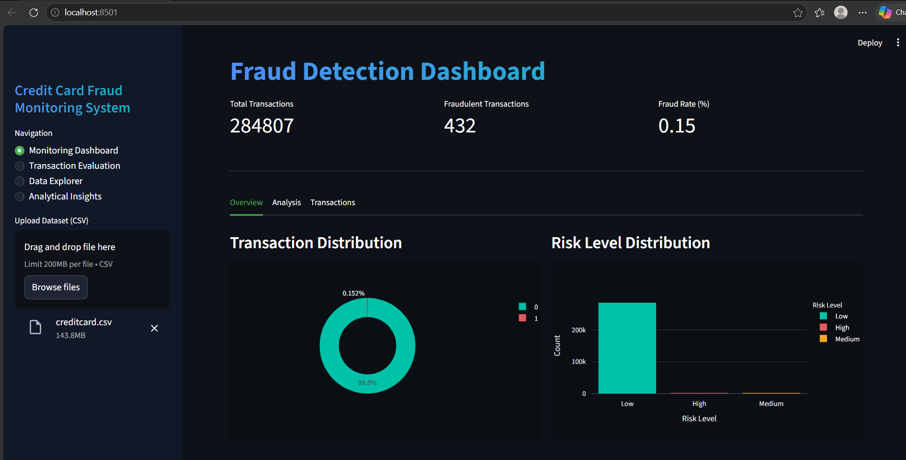
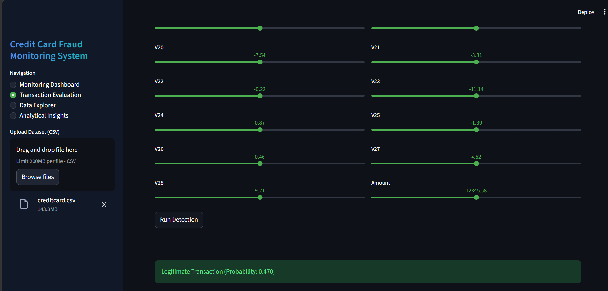
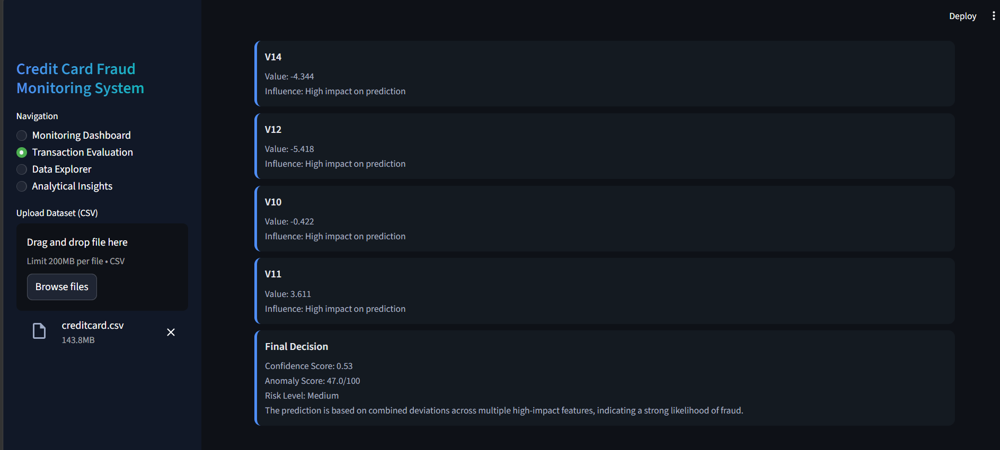
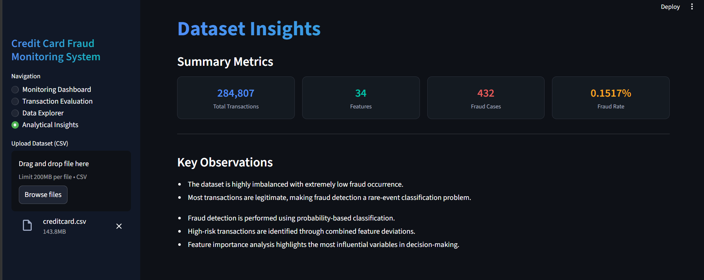

#  Credit Card Fraud Detection & Risk Analysis

Machine Learning-powered fraud detection and risk analysis dashboard for identifying suspicious credit card transactions.

---

##  Overview

Financial fraud detection is a critical challenge due to the highly **imbalanced nature of transaction data**, where fraudulent activities are rare but high-impact.

This project implements a **Random Forest-based classification model** integrated with an **interactive Streamlit dashboard** to:

- Detect fraudulent transactions  
- Assign probability-based risk scores  
- Provide actionable insights through visual analytics  

The system supports both **dataset-level analysis** and **single transaction evaluation**, making it practical and scalable.

---
##  Key Features

-  Upload and analyze transaction datasets (CSV)
-  Machine Learning-based fraud prediction (Random Forest)
-  Dynamic dashboard with interactive visualizations
-  Risk segmentation: Low / Medium / High
-  Fraud probability distribution and trend analysis
-  Feature importance for model interpretability
-  Single transaction evaluation with:
    -- Prediction (Fraud / Legitimate)
    -- Confidence Score
    -- Anomaly Score
    -- Key feature influence insights
-  Export high-risk transaction reports

---

## Dashboard Overview


### Real-Time Transaction Evaluation


#### Prediction Explanation


### Data Analytics Summary



---


## Dataset

The model was trained using the public dataset available on Kaggle:

**Credit Card Fraud Detection Dataset**

https://www.kaggle.com/datasets/mlg-ulb/creditcardfraud

### Dataset Characteristics:
- 284,807 transactions  
- 492 fraud cases (~0.17%)  
- Features: `V1–V28` (anonymized), `Amount`, `Time`


---

## Project Structure

```
Credit-Card-Fraud-Detection
│
├── images
│   ├── DashboardOverview.png
│   ├── Real-Timetransactionevaluation.png
│   ├── PredictionExplanation.png
│   ├── DataAnalyticsSummary.png
│
├── cdfd_app.py
├── credit-card-fraud-detection.ipynb
├── fraud_detection_random_forest.pkl
├── requirements.txt
├── README.md
├── .gitignore
│
└── .streamlit
    └── config.toml
```


---

## How to run the project

Install dependencies


pip install -r requirements.txt


Run the Streamlit dashboard


streamlit run cdfd_app.py


Upload the dataset through the dashboard to analyze fraud predictions.

---

## Tech Stack

Python • Streamlit • Scikit-learn • Pandas • Plotly • Matplotlib

---

##  Future Enhancements

*  **Real-time Fraud Detection:** Transition from batch processing to real-time inference by integrating streaming data pipelines using **Apache Kafka** or RESTful APIs.
    
*  **Advanced Modeling:** Implement and tune high-performance algorithms such as **XGBoost**, **LightGBM**, and **Deep Neural Networks** to improve detection precision and recall.
    
*  **Explainable AI (XAI):** Integrate **SHAP** (SHapley Additive exPlanations) or **LIME** to provide transparency into "black-box" model decisions, ensuring each fraud alert is interpretable.
    
*  **Model Deployment:** Package the model using **Flask** or **FastAPI** to expose it as a scalable REST API, enabling seamless integration with front-end applications or third-party services.
