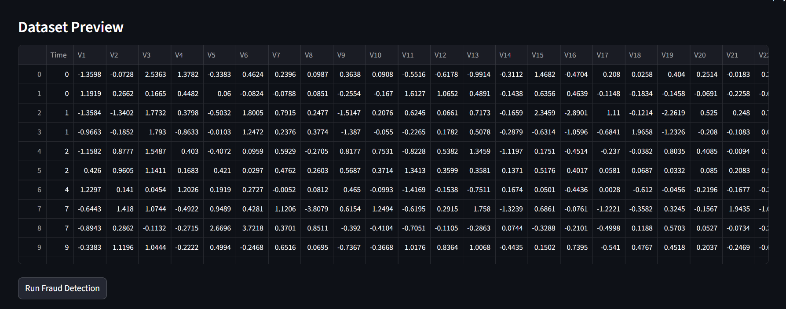
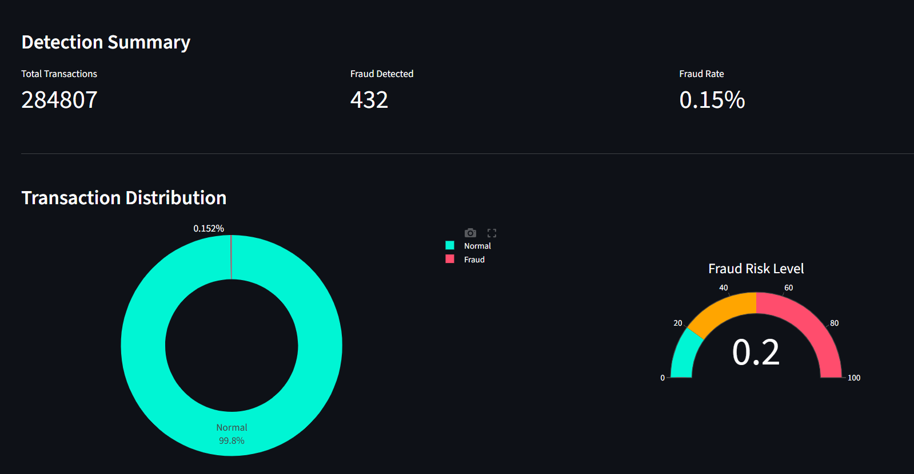
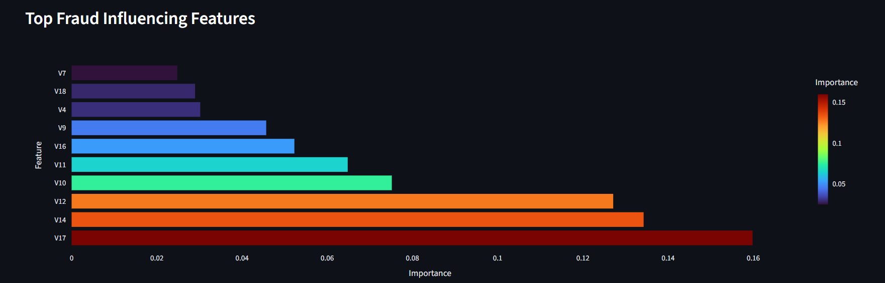
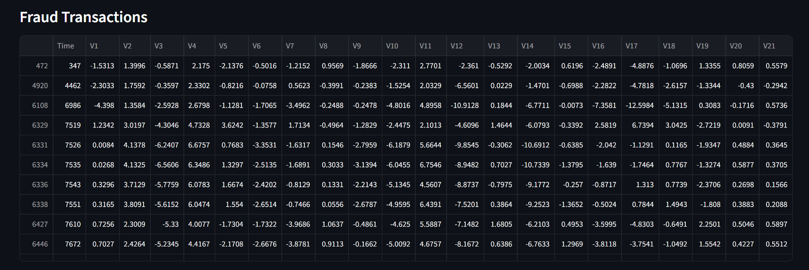
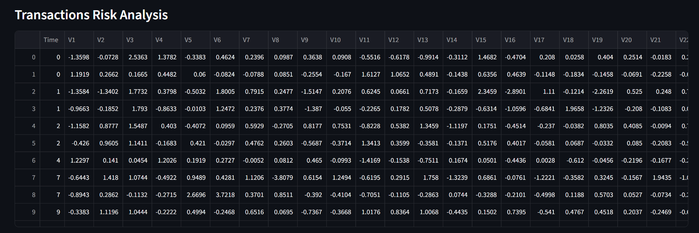

Credit Card Fraud Detection Dashboard

An interactive machine learning dashboard that detects potentially fraudulent credit card transactions and visualizes transaction risk patterns.

Overview

Credit card fraud detection is a classic imbalanced classification problem where fraudulent transactions represent a very small fraction of all transactions.
This project builds a Random Forest based fraud detection model and integrates it into an interactive Streamlit dashboard for analyzing transaction datasets.

The dashboard allows users to upload transaction data, run fraud predictions, and explore the results through visualizations and summaries.

Dashboard Preview

Key Features

Upload transaction dataset (CSV)

Fraud prediction using a trained ML model

Detection summary metrics (Total Transactions, Fraud Detected, Fraud Rate)

Fraud distribution visualization

Feature importance analysis

Table of detected fraudulent transactions

Dataset

The model was trained using the public dataset available on Kaggle:

Credit Card Fraud Detection Dataset
https://www.kaggle.com/datasets/mlg-ulb/creditcardfraud

The dataset contains anonymized transaction features (V1–V28) along with transaction amount and class labels.

Project Structure
Credit-Card-Fraud-Detection
│
├── cdfd_app.py    
├── images
     └── datasetpreview1.png
     └── dashboard1.png
     └── dashboard2.png
     └── fraudtransaction3.png
     └── transactionRiskAnalysis4.png           
├── fraud_detection_random_forest.pkl  
├── credit-card-fraud-detection.ipynb 
├── requirements.txt
├── README.md
├── .gitignore
│
└── .streamlit/
    └── config.toml
Running the Project

Install dependencies:

pip install -r requirements.txt

Run the dashboard:

streamlit run cdfd_app.py

Upload the dataset through the dashboard to analyze fraud predictions.

Tech Stack

Python • Streamlit • Scikit-learn • Pandas • Plotly • Matplotlib

